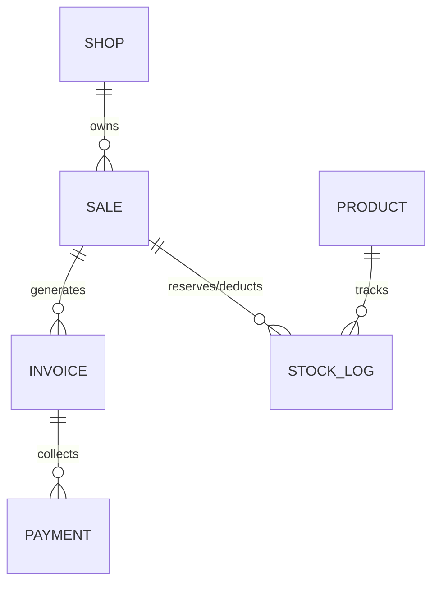
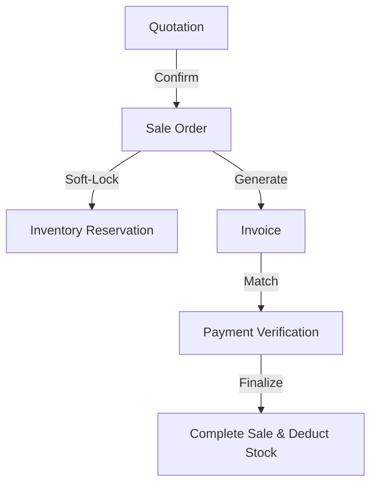
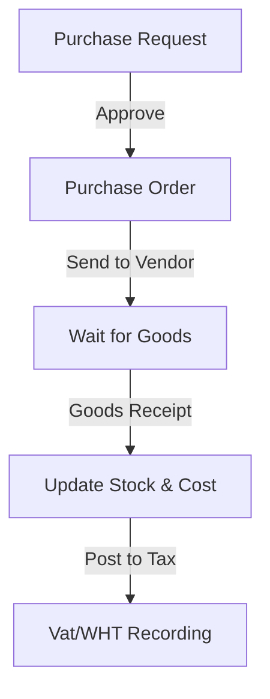

# Shop-Inventory to ERP (Practice Project)

โปรเจกต์ฝึกพัฒนาเพื่อศึกษาการขยายระบบจากระบบจัดการสต็อกสินค้า (Inventory) ไปสู่ระบบจัดการทรัพยากรองค์กร (ERP) โดยเน้นการฝึกฝนทักษะการออกแบบซอฟต์แวร์ที่รองรับการเติบโตของข้อมูล

## วัตถุประสงค์ในการพัฒนา (Learning Objectives)
1. **Software Architecture**: ฝึกการจัดโครงสร้างแบบ Domain-Driven (Rule of 6) เพื่อแยกส่วนงานที่ซับซ้อนออกจากกัน
2. **Data Integrity**: ฝึกการออกแบบฐานข้อมูลและความสัมพันธ์ที่ซับซ้อน เช่น การจัดการ Stock Reservation และ Document Lifecycle
3. **Enterprise Logic**: ฝึกการเขียนระบบบัญชีรายรับ-รายจ่าย และการคำนวณภาษี (VAT 7%, WHT 1/3/5%) ที่ใช้งานจริงในประเทศไทย
4. **Clean Code**: ฝึกการใช้ Type-Safe Service Contracts เพื่อลดข้อผิดพลาดในระบบขนาดใหญ่

---

## ฟังก์ชันการทำงาน (Core Functions)

### 1. ระบบคลังสินค้า (Inventory Management)
- **Product Catalog**: จัดการข้อมูลสินค้าพร้อม SKU, บาร์โค้ด, และการแบ่งหมวดหมู่
- **Stock Movement**: บันทึกทุกกิจกรรมการเคลื่อนไหว (รับเข้า, จ่ายออก, โอนย้าย) พร้อมชื่อผู้ดำเนินการและเวลาที่เกิดขึ้นจริง
- **Multi-Warehouse Support**: รองรับการแยกคลังสินค้าหลายจุดและการโอนย้ายสินค้าระหว่างคลัง (Stock Transfer)
- **Stock Take / Adjustment**: ระบบตรวจนับและปรับปรุงยอดสต็อกให้ตรงกับสภาพจริง

### 2. ระบบการขายและรายได้ (Sales & Revenue)
- **Document Workflow**: ระบบไหลของเอกสารเริ่มจาก ใบเสนอราคา (Quotation) -> รายการขาย (Sale) -> ใบแจ้งหนี้ (Invoice)
- **Inventory Reservation**: ระบบ "ลอคสินค้าชั่วคราว" เมื่อมีการยืนยันรายการขาย เพื่อป้องกันการขายสินค้าเกินจำนวนที่มีอยู่จริง
- **Payment Verification**: ระบบอัปโหลดหลักฐานการโอนเงิน (Slip) และตรวจสอบความถูกต้องก่อนปิดรายการขาย
- **Profit Analysis**: ระบบคำนวณกำไรเบื้องต้น (Gross Profit) จากต้นทุนสินค้าจริงในแต่ละรายการขาย

### 3. ระบบจัดซื้อและต้นทุน (Purchasing)
- **Purchase Workflow**: ระบบจัดการใบขอซื้อ (Purchase Request) และใบสั่งซื้อ (Purchase Order)
- **Supplier Management**: ระบบจัดการข้อมูลผู้จ่ายสินค้า (Suppliers) พร้อมประวัติการสั่งซื้อ
- **Landed Cost**: การบันทึกรับสินค้าเข้าสต็อกพร้อมอัปเดตต้นทุนสินค้า (Cost Price) อัตโนมัติ

### 4. ระบบบัญชีและภาษีไทย (Financials & Thai Tax)
- **Income/Expense Tracking**: บันทึกรายได้และค่าใช้จ่ายอื่นๆ ที่นอกเหนือจากการขายสินค้า
- **Thai Tax Compliance**:
    - ระบบคำนวณและออกใบกำกับภาษีมูลค่าเพิ่ม (VAT 7%)
    - ระบบภาษีหัก ณ ที่จ่าย (Withholding Tax - WHT) สำหรับการจ่ายค่าบริการ
- **Period Locking**: ระบบล็อกช่วงเวลาบัญชีเพื่อป้องกันการแก้ไขข้อมูลย้อนหลัง

### 5. ระบบรักษาความปลอดภัยและจัดการ (Core System)
- **RBAC (Role-Based Access Control)**: กำหนดสิทธิ์ให้ผู้ใช้งานตามตำแหน่ง (เช่น เจ้าของร้าน, แคชเชียร์, พนักงานคลังสินค้า)
- **Sequence Generator**: ระบบรันเลขที่เอกสารอัตโนมัติที่สามารถตั้งค่า Format ได้ตามความต้องการ (เช่น INV-2024-0001)
- **Audit Logs**: ระบบบันทึกการใช้งาน ใคร ทำอะไร ที่ไหน เมื่อไหร่ สำหรับการตรวจสอบย้อนหลัง

---

## รายละเอียดทางเทคนิค (Technical Stack)
- **Frontend/Backend**: Next.js 14 (App Router)
- **Language**: TypeScript (Strict Mode)
- **Database**: PostgreSQL (Prisma ORM)
- **Form & Validation**: React Hook Form + Zod
- **Authentication**: NextAuth.js (Session-based)
- **Finance Logic**: Decimal.js สำหรับการคำนวณตัวเลขทางการเงินที่ไม่ให้เกิด Error จาก Floating Point

---

## ผังฐานข้อมูล (Database Schema - Simplified)
ความสัมพันธ์หลักของระบบที่แสดงถึงความเชื่อมโยงของเอกสารและสต็อกสินค้า:



---

## ตัวอย่างโค้ด (Code Snippet Spotlight)

### 1. Atomic Sequence Generator
ระบบรันเลขที่เอกสารที่รองรับการทำงานพร้อมกัน (Concurrency) โดยใช้ `upsert` ของ Prisma เพื่อให้มั่นใจว่าเลขเอกสารจะไม่ซ้ำกันอย่างแน่นอน

```typescript
// Algorithm: Atomic increment counter using Database Level Locking
const sequence = await tx.docSequence.upsert({
  where: { shopId_prefix_year_month: { shopId, prefix, year, month } },
  create: { shopId, prefix, year, month, counter: 1 },
  update: { counter: { increment: 1 } },
});

return formatSequenceNumber(prefix, yearStr, monthStr, sequence.counter);
```

### 2. Inventory Soft-Lock
การจองสินค้า (Reservation) โดยใช้ระบบ Movement Log ที่แยกประเภทเป็น `RESERVATION` แทนการลดจำนวนสินค้าตรงๆ เพื่อให้สามารถยกเลิกและตรวจสอบย้อนหลังได้ง่าย

```typescript
async reserveStock(productId, quantity, ctx, tx) {
  return this.recordMovement(ctx, {
    productId,
    type: 'RESERVATION',
    quantity,
    note: 'จองสินค้าสำหรับรายการขาย',
    tx,
  });
}
```

---

## โครงสร้างสถาปัตยกรรม (Architectural)

โปรเจกต์นี้ใช้โครงสร้างแบบ **Layered Architecture** เพื่อแยกความรับผิดชอบ (Separation of Concerns) ออกเป็นชั้นๆ ดังนี้:

- **1. Presentation Layer (`src/app`)**: รับผิดชอบเรื่อง Routing และ UI Layout โดยใช้ Next.js App Router
- **2. Interaction Layer (`src/actions`)**: ชั้นของ Server Actions ทำหน้าที่รับข้อมูลจาก UI, ตรวจสอบสิทธิ์ (Auth), และเรียกใช้ Service ที่เกี่ยวข้อง
- **3. Domain Service Layer (`src/services`)**: **หัวใจของระบบ** รวม Logic ธุรกิจทั้งหมดไว้ที่นี่แยกตาม Domain (เช่น Sales, Inventory, Accounting) โดยแต่ละ Service จะต้องทำตามสัญญา (Interface) ที่กำหนดไว้ใน `src/types/service-contracts.ts`
- **4. Governance Layer (`src/policies`)**: ชั้นที่รวบรวมกฎทางธุรกิจ (Business Rules) เช่น เงื่อนไขการล็อกเอกสาร หรือสิทธิ์การยกเลิก เพื่อให้ Logic เหล่านี้คงที่และไม่ปนกับโค้ดส่วนอื่น
- **5. Data Layer (Prisma)**: ชั้นการจัดการฐานข้อมูลและการจัดการความสัมพันธ์ของ Model

---

## ผังการทำงานหลัก (Core Workflows)

### 1. วงจรการขาย (Sales Lifecycle)


### 2. วงจรการจัดซื้อ (Purchasing Lifecycle)


---

## โครงสร้างในโค้ด (Module Structure)
```bash
src/
├── actions/      # รวม Server Actions (UI to Data)
├── services/     # รวม Logic ธุรกิจ (หัวใจของระบบ แยกตาม Domain)
├── policies/     # รวมกฎเกณฑ์ธุรกิจ (เช่น เงื่อนไขการยกเลิกเอกสาร)
├── schemas/      # รวม Zod Validation สำหรับ Form ต่างๆ
├── types/        # รวม Type และ Interface ทั้งหมด
└── components/   # รวม UI Components (แยกเป็น Features)
```

---

## วิธีการเริ่มต้น (Getting Started)
1. ติดตั้ง Library ทั้งหมด: `npm install`
2. สร้างไฟล์ `.env` และตั้งค่า `DATABASE_URL` ให้ตรงกับฐานข้อมูลของคุณ
3. Sync Database Schema: `npx prisma db push`
4. รันระบบในโหมดพัฒนา: `npm run dev`

---
*โปรเจกต์นี้เป็นโครงสร้างสำหรับการฝึกฝนทักษะการพัฒนา Web Application ขนาดใหญ่ และการจัดการ Logic ธุรกิจที่ซับซ้อนเท่านั้น*
