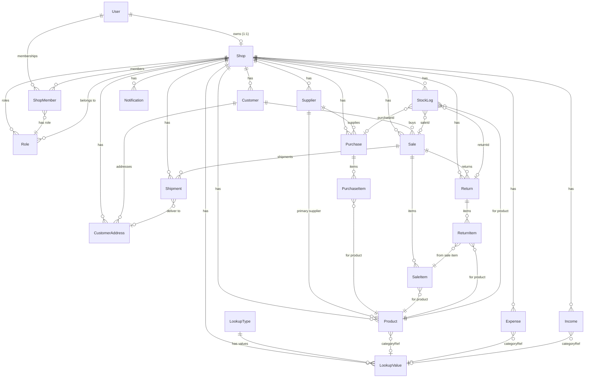
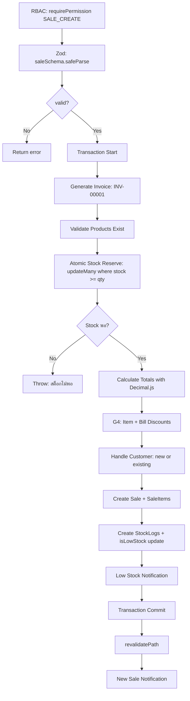

# 🔍 Shop-Inventory: Deep Structure & Flow Analysis

## 📋 Overview

Analyzed the entire Shop-Inventory codebase: **20 Prisma models (890 lines)**, **24 server actions**, **9 Zod validation schemas**, and all core libraries. Below is the comprehensive verdict.

---

## 1. Database Relation Map

---

## 2. Relation Integrity Verdict

### ✅ ถูกต้อง (Valid)

| Relation                              | Type                   | onDelete              | Comments                     |
| ------------------------------------- | ---------------------- | --------------------- | ---------------------------- |
| `User → Shop`                         | 1:1 (`@unique userId`) | Cascade               | ✅ ลบ User → ลบ Shop         |
| `Shop → Role`                         | 1:N                    | Cascade               | ✅ ลบ Shop → ลบ Role ทั้งหมด |
| `Shop → ShopMember`                   | 1:N                    | Cascade               | ✅ ลบ Shop → ลบสมาชิก        |
| `User → ShopMember`                   | 1:N                    | Cascade               | ✅ ลบ User → ลบ membership   |
| `ShopMember → Role`                   | N:1                    | ❌ **ไม่มี onDelete** | ⚠️ ดูด้านล่าง                |
| `LookupType → LookupValue`            | 1:N                    | Cascade               | ✅                           |
| `LookupValue → User`                  | N:1                    | Cascade               | ✅                           |
| `LookupValue → Shop`                  | N:1                    | Cascade               | ✅                           |
| `Product → Shop`                      | N:1                    | Cascade               | ✅                           |
| `Product → LookupValue` (categoryRef) | N:1                    | SetNull               | ✅ ลบ category → set null    |
| `Product → Supplier`                  | N:1                    | SetNull               | ✅ ลบ supplier → null ref    |
| `Purchase → Supplier`                 | N:1                    | ❌ **ไม่มี onDelete** | ⚠️ ดูด้านล่าง                |
| `PurchaseItem → Purchase`             | N:1                    | Cascade               | ✅                           |
| `PurchaseItem → Product`              | N:1                    | ❌ **ไม่มี onDelete** | ⚠️ ดูด้านล่าง                |
| `Sale → Customer`                     | N:1                    | ❌ **ไม่มี onDelete** | ⚠️ ดูด้านล่าง                |
| `SaleItem → Sale`                     | N:1                    | Cascade               | ✅                           |
| `SaleItem → Product`                  | N:1                    | ❌ **ไม่มี onDelete** | ⚠️ ดูด้านล่าง                |
| `Shipment → Sale`                     | N:1                    | ❌ **ไม่มี onDelete** | ⚠️ ดูด้านล่าง                |
| `Shipment → CustomerAddress`          | N:1                    | ❌ **ไม่มี onDelete** | ⚠️                           |
| `Return → Sale`                       | N:1                    | ❌ **ไม่มี onDelete** | ⚠️ ดูด้านล่าง                |
| `ReturnItem → Return`                 | N:1                    | Cascade               | ✅                           |
| `ReturnItem → SaleItem`               | N:1                    | ❌ **ไม่มี onDelete** | ⚠️                           |
| `ReturnItem → Product`                | N:1                    | ❌ **ไม่มี onDelete** | ⚠️                           |
| `StockLog → Product`                  | N:1                    | ❌ **ไม่มี onDelete** | ⚠️                           |
| `StockLog → Sale`                     | N:1                    | SetNull               | ✅                           |
| `StockLog → Purchase`                 | N:1                    | SetNull               | ✅                           |
| `StockLog → Return`                   | N:1                    | SetNull               | ✅                           |
| `CustomerAddress → Customer`          | N:1                    | Cascade               | ✅                           |
| `Notification → Shop`                 | N:1                    | Cascade               | ✅                           |

### ⚠️ Missing `onDelete` — ไม่ใช่ Bug แต่ต้องระวัง

Relations ที่ไม่มี `onDelete` นั้น **Prisma จะ default เป็น Restrict** หมายความว่า:

- ลบ `Product` → **จะ error** ถ้ายังมี `SaleItem`, `PurchaseItem`, `ReturnItem`, `StockLog` ที่ reference อยู่
- ลบ `Customer` → **จะ error** ถ้ายังมี `Sale` ที่ reference อยู่
- ลบ `Supplier` → **จะ error** ถ้ายังมี `Purchase` ที่ reference อยู่

> [!NOTE]
> นี่เป็น **behavior ที่ถูกต้อง** สำหรับระบบ Financial เพราะห้ามลบข้อมูลที่มี Transaction ผูกอยู่ ระบบใช้ **Soft Delete** (`deletedAt`) แทนการ Hard Delete ดังนั้น Restrict เป็น safety net ที่ดี

### ⚠️ จุดที่ต้องระวัง 1 จุด

**`ShopMember.roleId → Role`** ไม่มี `onDelete` → ถ้าลบ Role ที่สมาชิกใช้อยู่ จะ error

> [!WARNING]
> ถ้า Admin ลบ Role ที่มีสมาชิกใช้อยู่ จะได้ Prisma error `Foreign key constraint failed` ควรจะมี Application-level check ก่อนลบ Role (ตรวจว่า Role ไม่มี member ใช้อยู่เสียก่อน)

---

## 3. Business Flow Analysis

### 3.1 🛒 Sales Flow (createSale)

**Verdict:** ✅ **ถูกต้องสมบูรณ์**

- Race condition: ✅ `atomicReserveStock` ใช้ `updateMany where stock >= qty`
- Invoice number: ✅ Retry 5 ครั้ง + collision check
- Math precision: ✅ ใช้ `money.ts` (Decimal.js) ทุกจุด
- G4 Discounts: ✅ Both item-level and bill-level
- G1 Payment: ✅ Cash auto-verify, Transfer → PENDING

### 3.2 ❌ Cancel Sale Flow

**Verdict:** ✅ **ถูกต้องสมบูรณ์**

- Cascading auto-cancel: ✅ Shipments + Returns
- Stock restore: ✅ Deducts already-returned qty (prevents double-restore)
- Auto-delete shipping expense: ✅ ลบ expense ที่สร้างอัตโนมัติ
- Stock log: ✅ Records `SALE_CANCEL` with reason

### 3.3 📦 Purchase Flow

**Verdict:** ✅ **ถูกต้อง มีจุดเล็ก 1 จุด**

- Stock increase: ✅ Uses `StockService.recordMovement` correctly
- Cost price update: ✅ Updates product costPrice on purchase
- Cancel: ✅ Checks stock won't go negative, reverts costPrice to previous purchase

> [!NOTE]
> `createPurchase` ใช้ Spread `...purchaseData` ลงใน `tx.purchase.create` ซึ่งจะ include `paymentMethod` จาก destructure ออกไปแล้ว → **ไม่มี paymentMethod field ใน Purchase model** → Prisma จะ ignore fields ที่ไม่ได้กำหนดใน schema โดยอัตโนมัติ ดังนั้นไม่มี error แต่ **ข้อมูล paymentMethod จะหายไป**

### 3.4 🔄 Returns Flow

**Verdict:** ✅ **ถูกต้องสมบูรณ์**

- Max returnable validation: ✅ Checks already-returned quantities
- Bill discount ratio: ✅ Calculates correct refund per unit including bill-level discount
- Financial adjustment: ✅ Adjusts sale `netAmount`, `totalCost`, `profit` correctly
- Stock restore: ✅ Via StockService

### 3.5 🚚 Shipment Flow

**Verdict:** ✅ **ถูกต้อง**

- Status transition validation: ✅ Finite state machine pattern
- Auto-expense on shipping cost: ✅
- One active shipment per sale: ✅ Application-level check
- Sale-cancel → auto-cancel shipments: ✅ Handled in `cancelSale`

### 3.6 📊 Dashboard & Reports

**Verdict:** ✅

- `getTodaySales`: ✅ Uses `netAmount` (not `totalAmount`) for revenue
- Aggregate queries: ✅ Uses `toNumber()` consistently

---

## 4. Validation Schema Analysis

| Schema                  | sanitizeText                         | Max Length      | Input Range               | Status |
| ----------------------- | ------------------------------------ | --------------- | ------------------------- | ------ |
| `saleSchema`            | ✅ customerName, notes               | ✅ 200/1000     | ✅ salePrice ≥ 0, qty ≥ 1 | ✅     |
| `purchaseSchema`        | ✅ notes                             | ✅ 1000         | ✅ costPrice ≥ 0, qty ≥ 1 | ✅     |
| `productSchema`         | ✅ name, description                 | ✅ 200/1000/50  | ✅ prices max 999999999   | ✅     |
| `expenseSchema`         | ✅ description, notes                | ✅ 500/1000     | ✅ amount ≥ 0.01          | ✅     |
| `incomeSchema`          | ✅ description, notes                | ✅ 500/1000     | ✅ amount ≥ 0.01          | ✅     |
| `supplierSchema`        | ✅ name, contactName, address, notes | ✅ All fields   | N/A                       | ✅     |
| `customerSchema`        | ✅ name, address, notes              | ✅ 200/500/1000 | ✅ phone regex            | ✅     |
| `shipmentSchema`        | ❌ **ไม่มี** sanitize                | ✅              | ✅ shippingCost ≥ 0       | ⚠️     |
| `customerAddressSchema` | ❌ **ไม่มี** sanitize                | ✅              | N/A                       | ⚠️     |

> [!WARNING]
> **`shipmentSchema` และ `customerAddressSchema` ไม่มี `sanitizeText`**
>
> - `recipientName`, `shippingAddress`, `notes` ใน shipment schema ไม่ได้ sanitize → อาจมี XSS risk ถ้าแสดงผลโดยไม่ escape
> - `customerAddressSchema` — `recipientName`, `address` ไม่ sanitize เช่นกัน
> - React (JSX) จะ auto-escape ใน `{}` แต่ถ้ามี `dangerouslySetInnerHTML` จะเป็นช่องโหว่

---

## 5. RBAC & Multi-Tenancy Check

| Check Point                           | Status | Finding                        |
| ------------------------------------- | ------ | ------------------------------ |
| ทุก action ใช้ `requirePermission`    | ✅     | ครบทั้ง 24 files               |
| ทุก query filter by `shopId`          | ✅     | ตรวจแล้วครบ                    |
| Owner bypass permissions              | ✅     | `if (ctx.isOwner) return true` |
| Session caching                       | ✅     | `cache()` React per-request    |
| Permission granularity                | ✅     | 35+ permissions                |
| No raw `userId` filter (use `shopId`) | ✅     | All queries use `shopId`       |

---

## 6. Financial Integrity Check

| Check Point                                  | Status                                           |
| -------------------------------------------- | ------------------------------------------------ |
| `money.ts` ใช้ Decimal.js                    | ✅ precision: 20, ROUND_HALF_UP                  |
| `toNumber()` ใช้ทุกที่ที่แปลง Prisma Decimal | ✅                                               |
| DB ใช้ `@db.Decimal(10,2)`                   | ✅ ทุก money field                               |
| Profit calc = revenue - cost                 | ✅ Both item-level and bill-level                |
| Discount ไม่เกิน totalAmount                 | ✅ `if (billDiscountAmount > totalAmount)` guard |
| Aggregate ใช้ `toNumber()`                   | ✅                                               |

---

## 7. Stock Management Integrity

| Check Point                       | Status                               |
| --------------------------------- | ------------------------------------ |
| Atomic stock reserve (Sale)       | ✅ `updateMany where stock >= qty`   |
| Atomic stock increment (Purchase) | ✅ Via `StockService.recordMovement` |
| Return restore stock              | ✅                                   |
| Cancel sale restore stock         | ✅ Deducts already-returned          |
| Cancel purchase check negative    | ✅                                   |
| `isLowStock` flag sync            | ✅ Updated after every movement      |
| Balance snapshot in StockLog      | ✅                                   |

---

## 8. สรุป Issues ที่พบ

### 🔴 Critical: 0 จุด

### 🟡 Medium: 2 จุด

1. **Purchase `paymentMethod` หายไป**
   - [purchaseSchema](file:///c:/Users/asus/Desktop/Project/Shop-inventory/src/schemas/purchase.ts) validate `paymentMethod`
   - แต่ [Purchase model](file:///c:/Users/asus/Desktop/Project/Shop-inventory/prisma/schema.prisma#L402-L449) ใน Prisma **ไม่มี field `paymentMethod`** → Prisma จะ silently ignore
   - ผล: ข้อมูลวิธีจ่ายเงินของ Purchase ไม่ถูกบันทึกลง DB

2. **Missing `sanitizeText` ใน 2 schemas**
   - `shipmentSchema` — recipientName, shippingAddress, notes
   - `customerAddressSchema` — recipientName, address

### 🟢 Low / Cosmetic: 3 จุด

3. **`verifyPayment` ใช้ `z.string().uuid()` validate `saleId`** แต่ระบบใช้ `cuid()` ไม่ใช่ UUID → อาจ reject valid IDs
   - [sales.ts:859](file:///c:/Users/asus/Desktop/Project/Shop-inventory/src/actions/sales.ts#L859)

4. **StockLog ยังใช้ deprecated fields** (`referenceId`, `referenceType`) ควบคู่ไปกับ explicit FK (`saleId`, `purchaseId`, `returnId`) ในส่วนของ `createSale` — ค่า explicit FK `saleId` ไม่ได้ถูก set ลงไป
   - [sales.ts:532-544](file:///c:/Users/asus/Desktop/Project/Shop-inventory/src/actions/sales.ts#L532-L544) writes to `referenceId` but not `saleId`

5. **Customer Profile stats** ใช้ `Number()` แทน `toNumber()` ในบางจุด — ไม่ error แต่ไม่สอดคล้องกับ convention
   - [customers.ts:263-264](file:///c:/Users/asus/Desktop/Project/Shop-inventory/src/actions/customers.ts#L263-L264)

---

## 9. Final Verdict

| Category               | Score      | Note                                      |
| ---------------------- | ---------- | ----------------------------------------- |
| **Database Relations** | 9/10       | ✅ ครบ, Restrict ที่ถูกจุด                |
| **Validation (Zod)**   | 8.5/10     | ⚠️ 2 schemas ไม่ sanitize                 |
| **RBAC**               | 10/10      | ✅ ครบทุก action                          |
| **Multi-Tenancy**      | 10/10      | ✅ shopId filter ทุก query                |
| **Financial Math**     | 10/10      | ✅ Decimal.js + toNumber()                |
| **Stock Management**   | 10/10      | ✅ Atomic, race-safe                      |
| **Concurrency**        | 9.5/10     | ✅ Retry, optimistic lock, atomic updates |
| **Overall**            | **9.5/10** | Production-ready, minor fixes needed      |

> [!IMPORTANT]
> ระบบมีคุณภาพระดับ Production ✅ ไม่มี Critical bug. มีเพียง 2 จุด Medium ที่ควร fix (Purchase paymentMethod ไม่เซฟ, และ verifyPayment UUID validation) ก่อน deploy จริง
