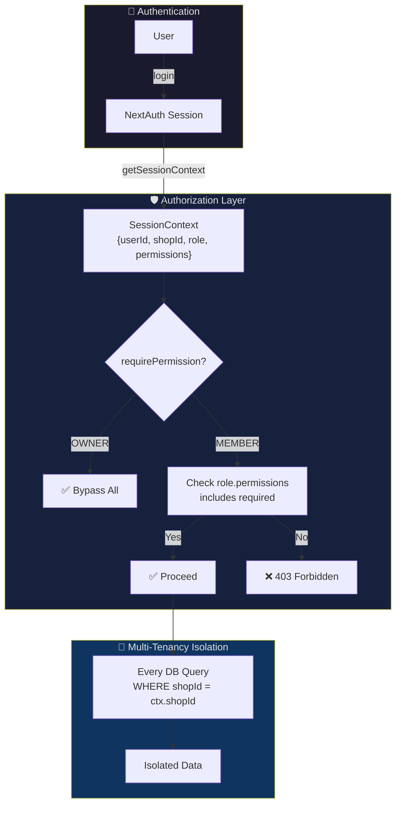
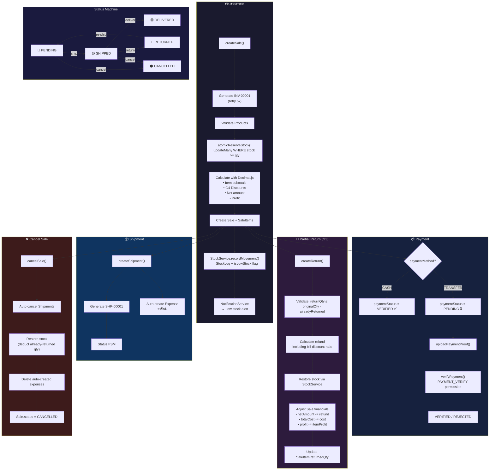
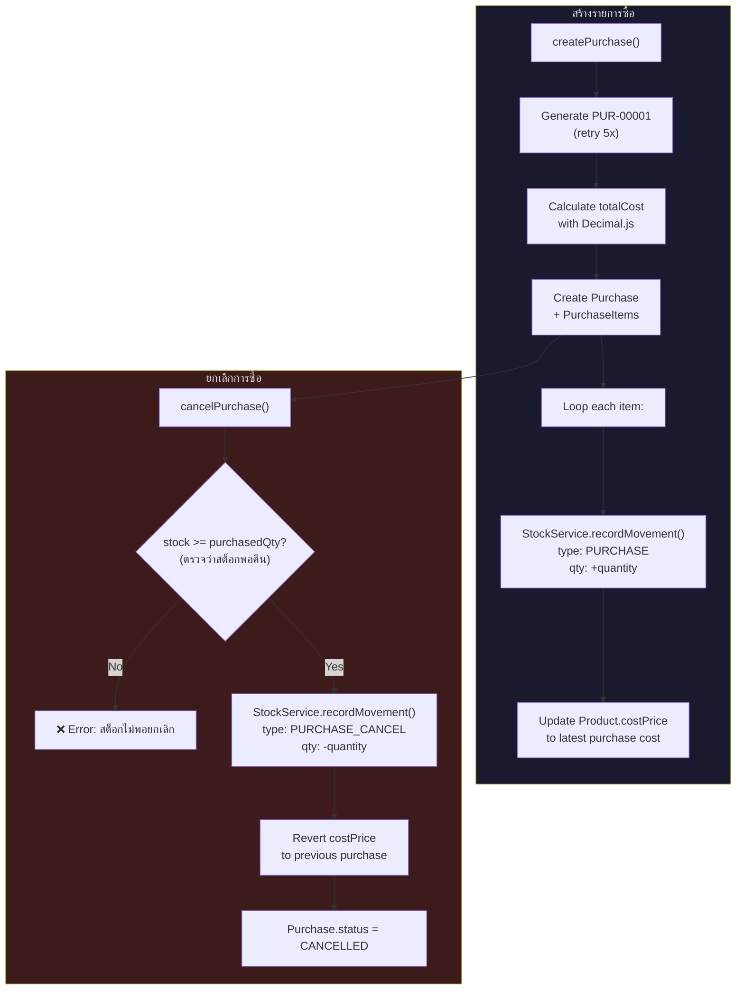
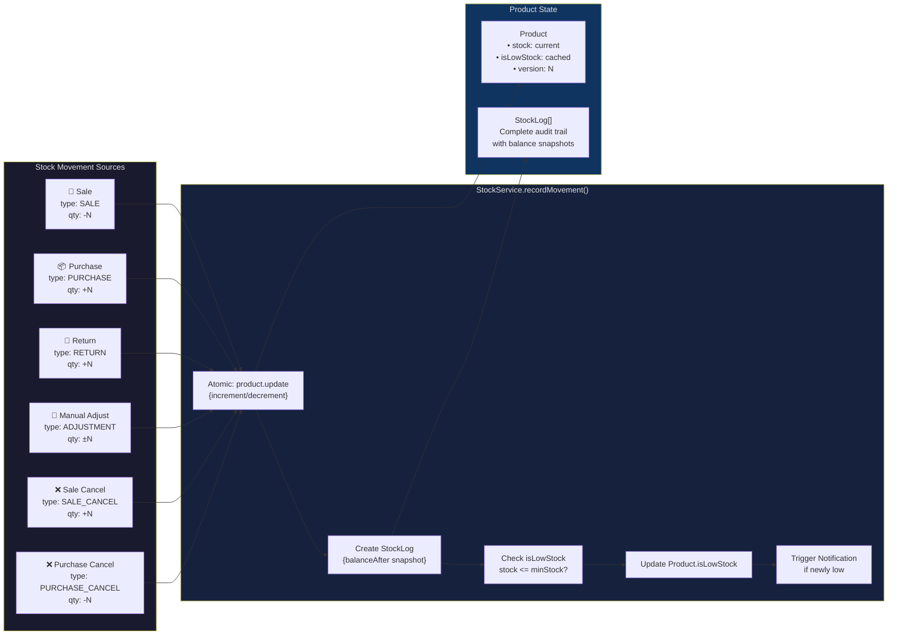
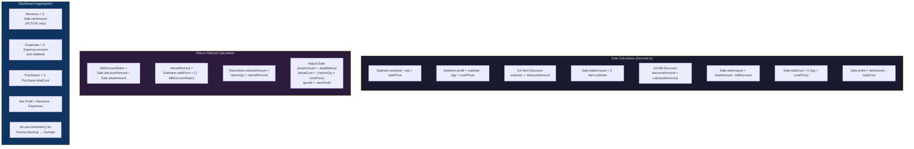
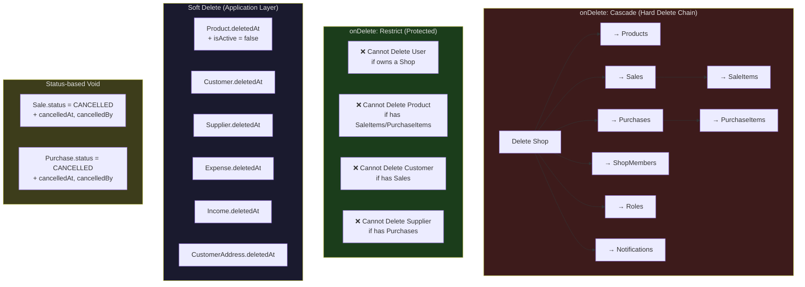

# 📊 Shop-Inventory: Database Relations & Flow Diagrams

## 1. Full Entity-Relationship Diagram

```mermaid
erDiagram
    User {
        string id PK "cuid()"
        string email UK
        string name
        string password
        string image
        datetime lastActiveAt
    }

    Shop {
        string id PK "cuid()"
        string name "ชื่อร้าน"
        string address
        string phone
        string logo
        string taxId
        string invoicePrefix "default: INV"
        string userId UK,FK "เจ้าของ (Restrict)"
    }

    Role {
        string id PK "cuid()"
        string name "ชื่อ Role"
        string shopId FK
        string[] permissions "Permission enum array"
        boolean isDefault
    }

    ShopMember {
        string id PK "cuid()"
        string userId FK
        string shopId FK
        string roleId FK
    }

    LookupType {
        string id PK "cuid()"
        enum code "PRODUCT_CATEGORY etc"
        string label
    }

    LookupValue {
        string id PK "cuid()"
        string lookupTypeId FK
        string code
        string label
        int sortOrder
        string shopId FK
        string userId FK
    }

    Product {
        string id PK "cuid()"
        string name
        string sku UK
        string category
        string categoryRefId FK "→ LookupValue"
        decimal costPrice "Decimal(10,2)"
        decimal salePrice "Decimal(10,2)"
        int stock
        int minStock "default: 5"
        boolean isLowStock "cached flag"
        boolean isActive "soft delete flag"
        string supplierId FK
        string imageUrl
        int version "optimistic lock"
        string shopId FK
        string userId FK
        datetime deletedAt
    }

    Supplier {
        string id PK "cuid()"
        string name
        string code UK
        string contactName
        string phone
        string email
        string address
        string taxId
        string shopId FK
        string userId FK
        datetime deletedAt
    }

    Customer {
        string id PK "cuid()"
        string name
        string phone
        string email
        string address
        string taxId
        string notes
        string shopId FK
        string userId FK
        datetime deletedAt
    }

    CustomerAddress {
        string id PK "cuid()"
        string customerId FK
        string label
        string recipientName
        string phone
        string address
        string district
        string province
        string postalCode
        boolean isDefault
        string shopId FK
        datetime deletedAt
    }

    Purchase {
        string id PK "cuid()"
        string purchaseNumber UK "PUR-00001"
        datetime date
        string supplierId FK
        string supplierName "deprecated"
        decimal totalCost "Decimal(10,2)"
        string paymentMethod "CASH/TRANSFER/CREDIT"
        string receiptUrl
        string notes
        string status "ACTIVE/CANCELLED"
        string cancelReason
        string shopId FK
        string userId FK
        datetime deletedAt
    }

    PurchaseItem {
        string id PK "cuid()"
        string purchaseId FK "Cascade"
        string productId FK
        int quantity
        decimal costPrice "Decimal(10,2)"
        decimal subtotal "Decimal(10,2)"
    }

    Sale {
        string id PK "cuid()"
        string invoiceNumber UK "INV-00001"
        datetime date
        string customerId FK
        string customerName "deprecated"
        decimal totalAmount "Decimal(10,2)"
        decimal totalCost "Decimal(10,2)"
        decimal profit "Decimal(10,2)"
        string discountType "PERCENT/FIXED"
        decimal discountValue "Decimal(10,2)"
        decimal discountAmount "Decimal(10,2)"
        decimal netAmount "Decimal(10,2)"
        string paymentMethod "CASH/TRANSFER/CREDIT"
        string paymentStatus "PENDING/VERIFIED/REJECTED"
        string paymentProof
        string channel "WALK_IN/SHOPEE/etc"
        string status "ACTIVE/CANCELLED"
        string cancelReason
        string shopId FK
        string userId FK
    }

    SaleItem {
        string id PK "cuid()"
        string saleId FK "Cascade"
        string productId FK
        int quantity
        decimal salePrice "Decimal(10,2)"
        decimal costPrice "Decimal(10,2)"
        decimal subtotal "Decimal(10,2)"
        decimal profit "Decimal(10,2)"
        decimal discountPercent "G4 item discount"
        decimal discountAmount "G4"
        int returnedQty "G3 tracking"
    }

    Shipment {
        string id PK "cuid()"
        string shipmentNumber UK "SHP-00001"
        string saleId FK
        string recipientName
        string recipientPhone
        string shippingAddress
        string customerAddressId FK
        string trackingNumber
        string shippingProvider
        decimal shippingCost "Decimal(10,2)"
        string status "FSM: 5 states"
        string notes
        datetime shippedAt
        datetime deliveredAt
        string shopId FK
        string userId FK
    }

    Return {
        string id PK "cuid()"
        string returnNumber UK "RET-00001"
        string saleId FK
        decimal totalRefund "Decimal(10,2)"
        string reason
        string notes
        string status "COMPLETED/CANCELLED"
        string shopId FK
        string userId FK
    }

    ReturnItem {
        string id PK "cuid()"
        string returnId FK "Cascade"
        string saleItemId FK
        string productId FK
        int quantity
        decimal refundAmount "Decimal(10,2)"
        decimal costPrice "Decimal(10,2)"
    }

    StockLog {
        string id PK "cuid()"
        string productId FK
        string type "SALE/PURCHASE/RETURN/etc"
        int quantity
        int balanceAfter "snapshot"
        string note
        string referenceId "deprecated"
        string referenceType "deprecated"
        string saleId FK "SetNull"
        string purchaseId FK "SetNull"
        string returnId FK "SetNull"
        string shopId FK
        string userId FK
    }

    Expense {
        string id PK "cuid()"
        string category
        string categoryRefId FK "→ LookupValue"
        decimal amount "Decimal(10,2)"
        string description
        datetime date
        string shopId FK
        string userId FK
        datetime deletedAt
    }

    Income {
        string id PK "cuid()"
        string category
        string categoryRefId FK "→ LookupValue"
        decimal amount "Decimal(10,2)"
        string description
        datetime date
        string shopId FK
        string userId FK
        datetime deletedAt
    }

    Notification {
        string id PK "cuid()"
        string type "LOW_STOCK/NEW_SALE/etc"
        string severity "INFO/WARNING/CRITICAL"
        string title
        string message
        boolean isRead
        string link
        string shopId FK "Cascade"
    }

    User ||--o| Shop : "owns (Restrict)"
    User ||--o{ ShopMember : "memberships"
    Shop ||--o{ ShopMember : "members"
    Shop ||--o{ Role : "custom roles"
    ShopMember }o--|| Role : "assigned"

    Shop ||--o{ Product : "has"
    Shop ||--o{ Supplier : "has"
    Shop ||--o{ Customer : "has"
    Shop ||--o{ Purchase : "has"
    Shop ||--o{ Sale : "has"
    Shop ||--o{ Expense : "has"
    Shop ||--o{ Income : "has"
    Shop ||--o{ StockLog : "has"
    Shop ||--o{ Shipment : "has"
    Shop ||--o{ Return : "has"
    Shop ||--o{ Notification : "has"
    Shop ||--o{ CustomerAddress : "has"
    Shop ||--o{ LookupValue : "custom values"

    LookupType ||--o{ LookupValue : "defines"
    Product }o--o| LookupValue : "categoryRef"
    Product }o--o| Supplier : "primary supplier"

    Supplier ||--o{ Purchase : "supplies"
    Customer ||--o{ Sale : "buys"
    Customer ||--o{ CustomerAddress : "addresses"

    Purchase ||--o{ PurchaseItem : "items (Cascade)"
    PurchaseItem }o--|| Product : "product"

    Sale ||--o{ SaleItem : "items (Cascade)"
    SaleItem }o--|| Product : "product"
    Sale ||--o{ Shipment : "shipments"
    Sale ||--o{ Return : "returns"

    Return ||--o{ ReturnItem : "items (Cascade)"
    ReturnItem }o--|| SaleItem : "from sale item"
    ReturnItem }o--|| Product : "product"

    Shipment }o--o| CustomerAddress : "deliver to"

    StockLog }o--|| Product : "product"
    StockLog }o--o| Sale : "saleId (SetNull)"
    StockLog }o--o| Purchase : "purchaseId (SetNull)"
    StockLog }o--o| Return : "returnId (SetNull)"

    Expense }o--o| LookupValue : "categoryRef"
    Income }o--o| LookupValue : "categoryRef"
```

---

## 2. RBAC & Multi-Tenancy Model

**Permission List (35+):**

| Module    | VIEW | CREATE | EDIT | DELETE | Special         |
| --------- | ---- | ------ | ---- | ------ | --------------- |
| Product   | ✅   | ✅     | ✅   | ✅     | —               |
| Sale      | ✅   | ✅     | ✅   | ✅     | PAYMENT_VERIFY  |
| Purchase  | ✅   | ✅     | ✅   | ✅     | —               |
| Expense   | ✅   | ✅     | ✅   | ✅     | —               |
| Income    | ✅   | ✅     | ✅   | ✅     | —               |
| Customer  | ✅   | ✅     | ✅   | ✅     | —               |
| Supplier  | ✅   | ✅     | ✅   | ✅     | —               |
| Shipment  | ✅   | ✅     | ✅   | —      | SHIPMENT_CANCEL |
| Return    | ✅   | ✅     | —    | —      | —               |
| Dashboard | ✅   | —      | —    | —      | —               |
| Settings  | —    | —      | ✅   | —      | MEMBER_MANAGE   |

---

## 3. Business Flow Diagrams

### 3.1 🛒 Sale → Stock → Shipment → Return Flow

### 3.2 📦 Purchase Flow

### 3.3 📊 Stock Movement Audit Trail

---

## 4. Financial Data Flow

---

## 5. Cascade & Deletion Strategy

---

## 6. Index Strategy Summary

| Model            | Indexes                         | Purpose                    |
| ---------------- | ------------------------------- | -------------------------- |
| **Product**      | `[shopId, isActive, deletedAt]` | Product list query         |
|                  | `[shopId, isLowStock]`          | Low stock dashboard        |
|                  | `[shopId, sku]` UK              | SKU uniqueness per shop    |
| **Sale**         | `[shopId, invoiceNumber]` UK    | Invoice uniqueness         |
|                  | `[shopId, date, status]`        | Date range + status filter |
|                  | `[shopId, paymentStatus]`       | Payment verification queue |
|                  | `[shopId, channel, date]`       | Channel analytics          |
| **Purchase**     | `[shopId, purchaseNumber]` UK   | PUR number uniqueness      |
|                  | `[shopId, date, status]`        | Date range + status filter |
| **Shipment**     | `[shopId, shipmentNumber]` UK   | SHP number uniqueness      |
|                  | `[shopId, saleId, status]`      | Active shipment check      |
| **StockLog**     | `[productId, createdAt]`        | Product history timeline   |
|                  | `[shopId, createdAt]`           | Shop-wide audit trail      |
| **Notification** | `[shopId, isRead, createdAt]`   | Unread notifications       |
